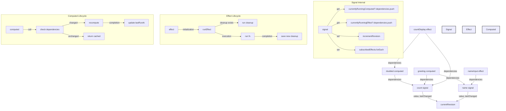

# Signals from scratch

To really understand how signals work, I implemented them from scratch.

Real implementations are more complex. They cover more edge cases and include both more features and optimizations.

My learnings from building [Jotai from scratch](https://github.com/tigerabrodi/jotai-from-scratch) did translate into this implementation nicely which felt good lol

A quick snippet into what I've implemented:

```js
const count = signal(0); // 📟
const doubled = computed(() => {
  console.log("Computing doubled..."); // 🔄
  return count.get() * 2;
});

// Runs on initial render and when every signal inside of it changes
effect(() => {
  console.log(`Count: ${count.get()} 🔢`);
  console.log(`Doubled: ${doubled()} ️`);
  return () => console.log("Cleanup! 🧹");
});

doubled(); // Cached! No 'Computing doubled...' log 🎯
count.set(1); // Triggers effect & recomputes doubled
doubled(); // Still cached because already in effect! 🚀
```

# Diagram video

[VIDEO PLACEHOLDER]

# Diagram in mermaid



# A few things that could improve the current implementation

## 1. Effect Batching & Queue System

```js
let animationFrameId = null;
const effectQueue = new Set();

function queueEffect(runEffect) {
  effectQueue.add(runEffect);

  if (!animationFrameId) {
    animationFrameId = requestAnimationFrame(() => {
      const effects = Array.from(effectQueue);
      effectQueue.clear();
      animationFrameId = null;
      effects.forEach((fn) => fn());
    });
  }
}
```

WHY: Batching effects is important for DOM updates especially. Because we can batch and have effects actually run during paint instead of causing multiple reflows (needing to calculate layout).

## 2. Error Boundaries for Effects

```js
function effect(fn, errorHandler) {
  const runEffect = () => {
    try {
      cleanup = fn();
    } catch (error) {
      if (errorHandler) errorHandler(error);
      else console.error("Effect Error:", error);
    }
  };
}
```

WHY: Effects failing silently can lead to hard-to-debug issues. Having proper error handling helps knowing what's wrong and fixing it. Or showing a fallback UI.

## 3. Lazy Initial Values for Signals

```js
function signal(initialValue) {
  let initialized = false;
  let value;

  return {
    get() {
      if (!initialized) {
        value =
          typeof initialValue === "function" ? initialValue() : initialValue;
        initialized = true;
      }
      return value;
    },
  };
}
```

In hindsight, it'd be cleaner having this a complete different primitive. An optional `lazy` flag on the signal can work but quickly becomes messy as you start adding more and more flags.

WHY: Expensive initial values (like heavy computations) shouldn't run until the signal is actually used. This improves startup performance.
